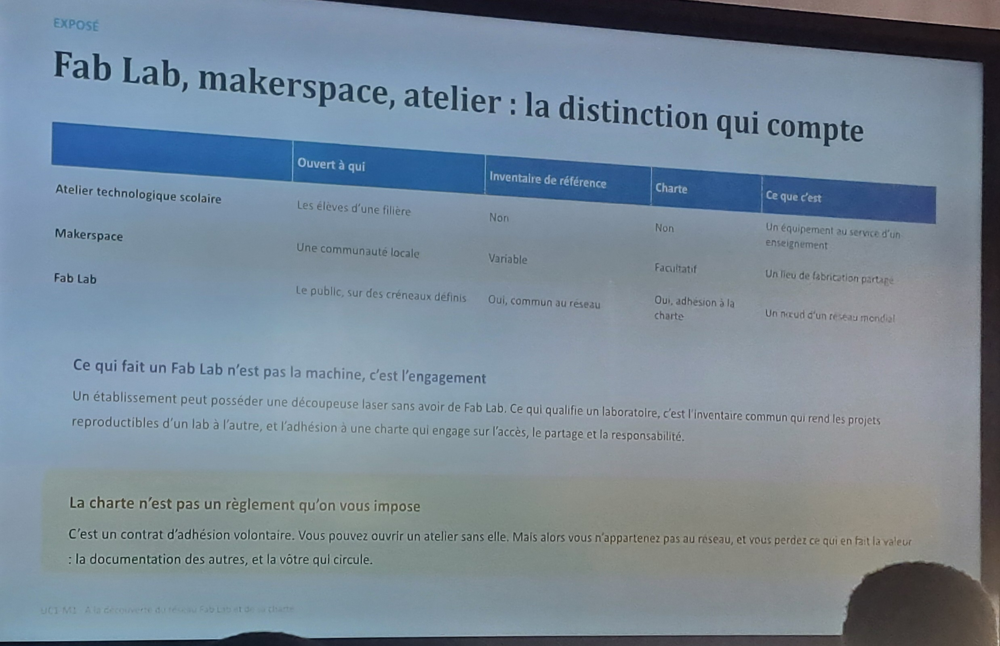

# Journal - mardi 25 août 2026 (rédigé par : Aimée AMEGNONA)

<!-- > **Modèle à dupliquer chaque jour ouvré** sous le nom `AAAA-MM-JJ.md`.
> Exigence ED-06 : cinq rubriques, auteur nommé, au moins une photo,
> au moins un paramètre ou une mesure. Rédigé le jour même.
> Supprimer ce bloc de citation dans les entrées réelles. -->

## Fait aujourd'hui
Création de dépôt dans Github  
Initialiser un dépot  
Faire un commit en ligne    
Formation des groupes de travail.
Exposé sur l'historique de fablab

- [Action + paramètres chiffrés avec unités]

- 

## Appris

-J'ai appris a faire le dépôt local et en ligne de mon journal.
A insérer une image dans mon journal. Il existait déjà quelques fablabs au Togo dont le prmemier est WOELAB. 

## Raté, puis corrigé

- Disparution de mon dépôt local dans vscode  dû au mauvais fonctionnemnt de l'ordinateur ce qui a entrainer la desinstalation de Git.La réinstalation du Git puis clonage du dépôt distant a permis de retrouver lr depôt local.

## Décidé

- [Arbitrage rendu et son motif] → issue #NN fermée / BOM mise à jour

## À faire demain

- [Action] — Prénom
- [Action] — Prénom
